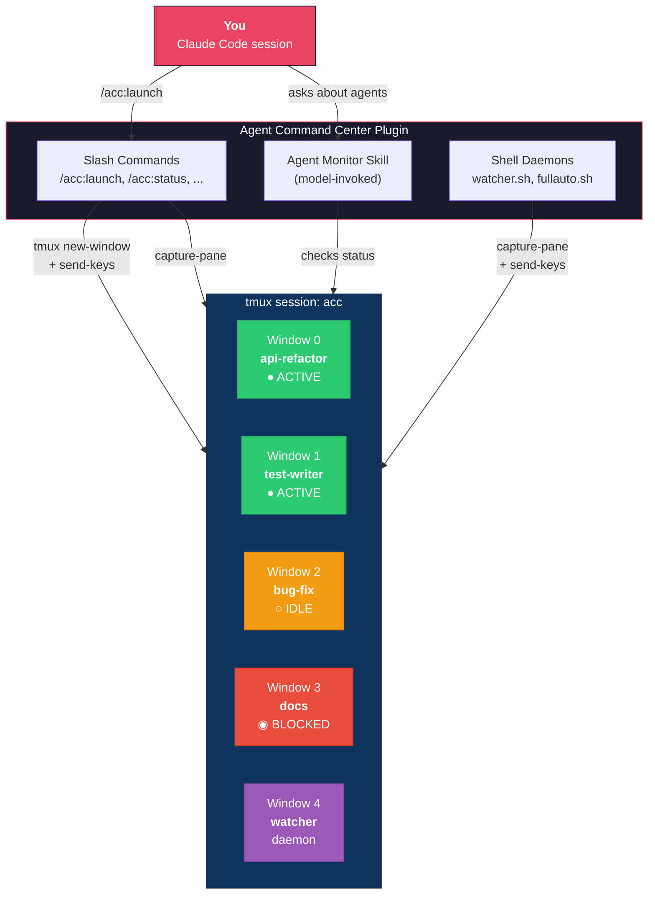
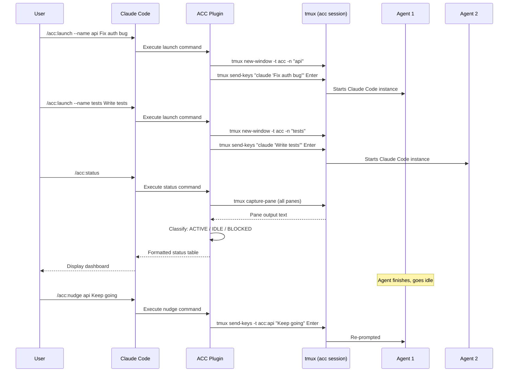
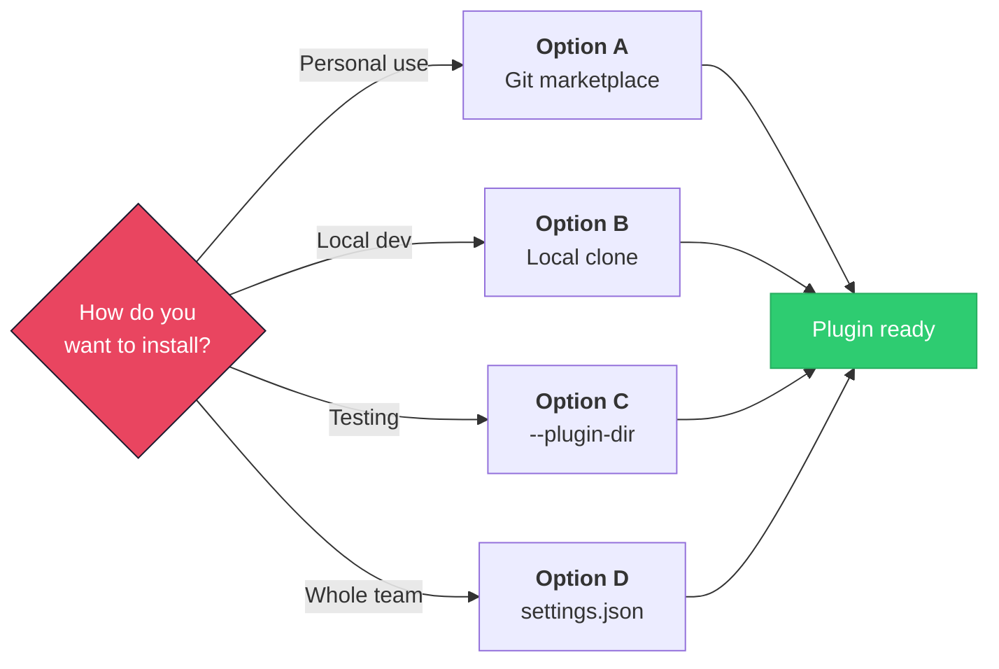
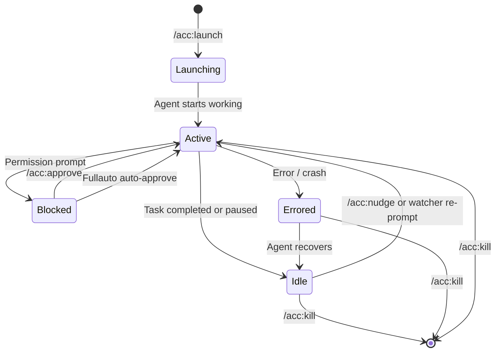
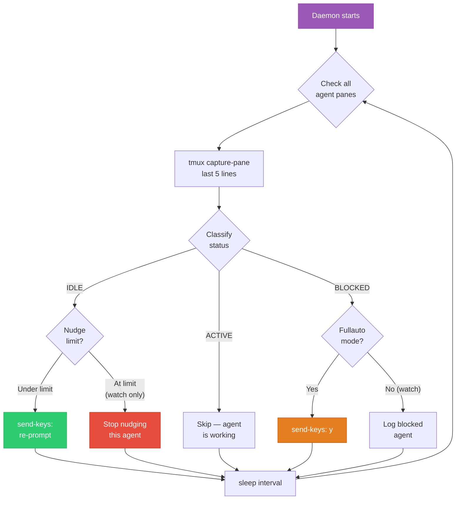
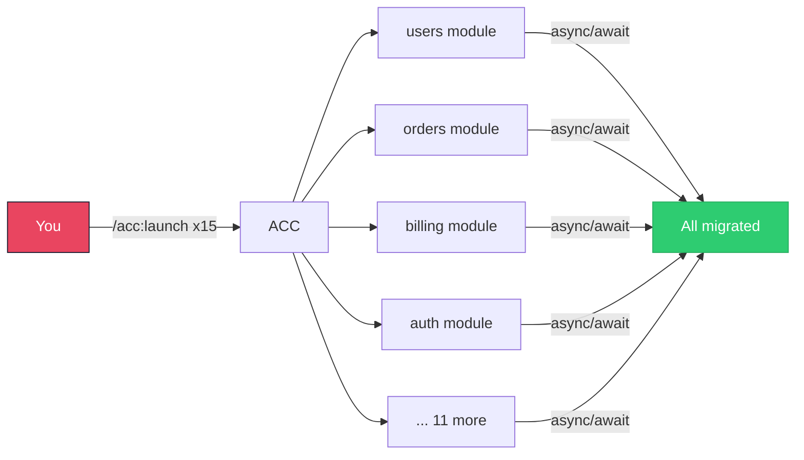

# Agent Command Center (ACC)

**A Claude Code plugin for managing teams of parallel AI agents via tmux.**

Inspired by [Andrej Karpathy's call](https://x.com/karpathy) for a proper "Agent Command Center IDE" that goes beyond tmux grids — with observability on status, idle detection, auto-nudging, progress tracking, and resource usage.

> *"tmux grids are awesome, but I feel a need to have a proper 'agent command center' IDE for teams of them... I want to see/hide toggle them, see if any are idle, pop open related tools, stats (usage), etc."*
> — Andrej Karpathy

```
╔══════════════════════════════════════════════════════════════════╗
║                     AGENT COMMAND CENTER                        ║
╠══════════════════════════════════════════════════════════════════╣
║  Session: acc    Agents: 4    Active: 2   Idle: 1   Blocked: 1 ║
╠══════════════════════════════════════════════════════════════════╣
║                                                                  ║
║  [1] api-refactor (0.0)                      ● ACTIVE  [34m]   ║
║      Task: Refactor API endpoints to async/await                 ║
║                                                                  ║
║  [2] test-writer (0.1)                       ● ACTIVE  [12m]   ║
║      Task: Write tests for utils module                          ║
║                                                                  ║
║  [3] bug-fix (1.0)                           ○ IDLE    [45m]   ║
║      Task: Fix auth bug                                          ║
║                                                                  ║
║  [4] docs (1.1)                              ◉ BLOCKED [8m]    ║
║      Task: Update API documentation                              ║
╚══════════════════════════════════════════════════════════════════╝
```

---

## Table of Contents

- [High-Level Architecture](#high-level-architecture)
- [Prerequisites](#prerequisites)
- [Installation](#installation)
- [Quick Start Tutorial](#quick-start-tutorial)
- [Commands Reference](#commands-reference)
- [Agent Lifecycle](#agent-lifecycle)
- [Watcher & Fullauto Flow](#watcher--fullauto-flow)
- [Use Cases](#use-cases)
- [Plugin Structure](#plugin-structure)
- [Tips and Best Practices](#tips-and-best-practices)
- [Troubleshooting](#troubleshooting)
- [Contributing](#contributing)
- [License](#license)

---

## High-Level Architecture



---

## How ACC Interacts with tmux



---

## Prerequisites

Before installing ACC, make sure you have:

1. **Claude Code v1.0.33 or later**
   ```bash
   claude --version
   # If outdated:
   brew upgrade claude-code     # Homebrew
   npm update -g @anthropic-ai/claude-code  # npm
   ```

2. **tmux installed**
   ```bash
   # macOS
   brew install tmux

   # Ubuntu/Debian
   sudo apt install tmux

   # Verify
   tmux -V
   ```

3. **Bash 4+** (required for the watcher/fullauto scripts that use associative arrays)
   ```bash
   bash --version
   # macOS ships Bash 3 — install Bash 5 via Homebrew:
   brew install bash
   ```

---

## Installation



### Option A: Install from Git (recommended)

The simplest way to install for personal use. Inside Claude Code, run:

```
/plugin marketplace add EvolvingAgentsLabs/agent-command-center
```

Then install the plugin:

```
/plugin install acc@EvolvingAgentsLabs-agent-command-center
```

Or use the interactive plugin browser:

```
/plugin
```

Navigate to the **Discover** tab, find **Agent Command Center**, and install it.

### Option B: Install from local clone

Clone the repository and point Claude Code to it:

```bash
git clone https://github.com/EvolvingAgentsLabs/agent-command-center.git
```

Then inside Claude Code:

```
/plugin marketplace add ./agent-command-center
```

### Option C: Development / test mode

Load the plugin directly without installing — useful for development and testing:

```bash
claude --plugin-dir ./agent-command-center
```

Changes are picked up instantly with `/reload-plugins` (no restart needed).

### Option D: Team-wide installation

Add the marketplace to your project's `.claude/settings.json` so every team member gets it automatically:

```json
{
  "extraKnownMarketplaces": {
    "acc": {
      "source": {
        "source": "github",
        "repo": "EvolvingAgentsLabs/agent-command-center"
      }
    }
  }
}
```

Team members then install with:

```
/plugin install acc@acc
```

### Verify installation

After installing, run `/help` — you should see all `/acc:*` commands listed. You can also run:

```
/acc:status
```

If no tmux session exists yet, it will tell you to launch your first agent.

---

## Quick Start Tutorial

### Step 1: Launch your first agent

Open Claude Code and spawn an agent into a tmux pane:

```
/acc:launch --name backend Fix all error handling in the API routes
```

This creates a tmux session called `acc`, opens a window named `backend`, and starts a Claude Code instance working on your task.

### Step 2: Launch more agents in parallel

Spawn additional agents for different tasks:

```
/acc:launch --name tests Write unit tests for the auth module
/acc:launch --name docs Update the API documentation
```

You now have 3 agents working in parallel.

### Step 3: Check on them

See what everyone is doing:

```
/acc:status
```

```
Agent Command Center - Status
══════════════════════════════════════════════════════════════
 #  │ Window.Pane │ Status    │ Duration │ Last Activity
────┼─────────────┼───────────┼──────────┼──────────────
 1  │ backend     │ ● ACTIVE  │ 5:23     │ Editing src/routes/users.ts...
 2  │ tests       │ ● ACTIVE  │ 3:01     │ Running test suite...
 3  │ docs        │ ○ IDLE    │ 4:45     │ Waiting for input
══════════════════════════════════════════════════════════════
 Active: 2  Idle: 1  Total: 3
```

### Step 4: Nudge idle agents

The `docs` agent stopped. Get it moving again:

```
/acc:nudge docs Keep going — also add examples for each endpoint
```

Or nudge all idle agents at once:

```
/acc:nudge
```

### Step 5: Turn on the auto-watcher

Tired of manually nudging? Start the watcher daemon — it monitors every 30 seconds and re-prompts any idle agents automatically:

```
/acc:watch
```

### Step 6: Go full auto on a specific agent

For a long-running task that must not stop, engage fullauto mode. This is Karpathy's "whip" — no nudge limit, 10-second check intervals, and auto-approval of permission prompts:

```
/acc:fullauto backend You must complete the full refactor. Don't stop until every route uses async/await.
```

### Step 7: View the dashboard

Get the full command center overview with resource usage and per-agent details:

```
/acc:dashboard
```

### Step 8: Broadcast instructions to everyone

Need to pivot the whole team? Broadcast a message:

```
/acc:broadcast --all PRIORITY SHIFT: Drop current work and focus on the production bug in auth.ts
```

### Step 9: Clean up when done

Kill a specific agent:

```
/acc:kill docs
```

Shut down everything:

```
/acc:kill --all
```

---

## Commands Reference

| Command | Description | Example |
|:---|:---|:---|
| `/acc:launch` | Start a new Claude Code agent in a tmux pane | `/acc:launch --name api Fix the auth bug` |
| `/acc:status` | Show status table of all agents (ACTIVE/IDLE/BLOCKED/ERRORED) | `/acc:status` |
| `/acc:dashboard` | Rich overview with stats, duration, resource usage | `/acc:dashboard` |
| `/acc:watch` | Start background watcher that auto-nudges idle agents | `/acc:watch --interval 20` |
| `/acc:fullauto` | Aggressive auto-continue mode (no limits, auto-approve) | `/acc:fullauto api Don't stop` |
| `/acc:nudge` | One-shot re-prompt for idle agents | `/acc:nudge --all` |
| `/acc:broadcast` | Send a message to multiple agents at once | `/acc:broadcast Wrap up and commit` |
| `/acc:approve` | Approve a blocked agent's permission prompt | `/acc:approve 1.1` |
| `/acc:logs` | View recent output from an agent | `/acc:logs api --lines 100` |
| `/acc:grid` | Rearrange tmux pane layout | `/acc:grid tiled` |
| `/acc:kill` | Stop agents and clean up | `/acc:kill --idle` |

### Launch options

```
/acc:launch [options] <task description>

Options:
  --name NAME        Window name for the agent
  --count N, -n N    Number of agents to launch (default: 1)
  --dir PATH, -d     Working directory (default: current)
  --model MODEL, -m  Model override (e.g., sonnet, opus)
  --yolo             Auto-approve all permission prompts
```

### Watch options

```
/acc:watch [options] [prompt]

Options:
  --interval N, -i N      Check interval in seconds (default: 30)
  --max-nudges N          Max nudges per agent before giving up (default: 5)
  --filter PATTERN        Only watch matching agents
```

---

## Agent Lifecycle

Every agent follows this state machine. ACC detects transitions by reading tmux pane output.



### Status detection heuristics

| Status | Icon | Detection pattern |
|:---|:---:|:---|
| **ACTIVE** | `●` | Output contains `esc to interrupt`, `Thinking`, `Reading`, `Writing`, `Editing`, `Searching`, `Running` |
| **IDLE** | `○` | Output shows prompt (`>`, `$`, `claude>`) or completion phrases (`What would you like`, `How can I help`) |
| **BLOCKED** | `◉` | Output shows approval prompts (`Allow?`, `Y/n`, `Do you want to proceed?`) |
| **ERRORED** | `✗` | Output contains `Error:`, `Traceback`, `panic:` |

---

## Watcher & Fullauto Flow



### Watcher vs. Fullauto

| Feature | `/acc:watch` | `/acc:fullauto` |
|:---|:---|:---|
| Scope | All agents | Single agent (or `--all`) |
| Check interval | 30s (configurable) | 10s |
| Max nudges | 5 per agent (configurable) | Unlimited |
| Auto-approve | No | Yes |
| Use case | General monitoring | Must-not-stop tasks |

---

## Use Cases

### Large-scale codebase refactoring



You need to migrate a monolith to async/await across 15 modules. One agent per module, all running in parallel:

```
/acc:launch --name users-module   --dir ./src/modules/users   Refactor to async/await
/acc:launch --name orders-module  --dir ./src/modules/orders  Refactor to async/await
/acc:launch --name billing-module --dir ./src/modules/billing Refactor to async/await
# ... repeat for each module
/acc:watch Continue the refactor. Don't stop until every function is async.
/acc:dashboard
```

**Why ACC helps**: Without it, you'd manually open 15 terminal tabs, lose track of which agents stopped, and spend your time copy-pasting "keep going" into idle panes. ACC automates all of that.

### Parallel test writing

Your project has zero test coverage. Launch agents by domain:

```
/acc:launch --name test-auth  --yolo Write comprehensive tests for src/auth/
/acc:launch --name test-api   --yolo Write comprehensive tests for src/api/
/acc:launch --name test-utils --yolo Write comprehensive tests for src/utils/
/acc:fullauto --all Write more tests. Aim for 90% coverage.
```

**Why ACC helps**: Test writing is tedious and repetitive — perfect for parallel agents. The `--yolo` flag lets agents create files and run tests without asking. Fullauto keeps them going until coverage is met.

### Research and exploration

Investigating a new codebase or technology? Launch focused research agents:

```
/acc:launch --name arch-review  Analyze the project architecture and document it
/acc:launch --name dep-audit    Audit all dependencies for security vulnerabilities
/acc:launch --name perf-profile Profile the app and identify performance bottlenecks
/acc:status
```

**Why ACC helps**: Each research track runs independently. You get three analyses in the time it takes for one, and `/acc:logs` lets you check findings from any agent without switching contexts.

### Bug hunting across a codebase

Multiple bug reports came in. Attack them in parallel:

```
/acc:launch --name bug-123 Fix issue #123: login fails on Safari
/acc:launch --name bug-456 Fix issue #456: race condition in checkout
/acc:launch --name bug-789 Fix issue #789: memory leak in dashboard
/acc:watch --interval 15 Keep debugging. If the fix doesn't work, try a different approach.
```

**Why ACC helps**: Bugs are independent work items. Instead of serial debugging, agents work simultaneously. The watcher ensures nobody stalls, and if an agent gets stuck, you can nudge it with a different strategy.

### CI/CD pipeline and DevOps tasks

Parallelize infrastructure work:

```
/acc:launch --name dockerfile  Optimize the Dockerfile — reduce image size
/acc:launch --name gh-actions  Add CI pipeline with lint, test, build stages
/acc:launch --name terraform   Write Terraform configs for staging environment
```

**Why ACC helps**: DevOps tasks are often independent but slow. Running agents in parallel for Docker, CI, and IaC means you get all three done concurrently.

### Documentation sprint

Catch up on docs across the entire project:

```
/acc:launch --name api-docs     Generate OpenAPI docs from the route handlers
/acc:launch --name readme       Write a comprehensive README with examples
/acc:launch --name architecture Write architecture decision records (ADRs)
/acc:launch --name onboarding   Create a developer onboarding guide
/acc:fullauto --all Be thorough. Include examples and diagrams where possible.
```

**Why ACC helps**: Documentation is a classic "background task" — important but not urgent. ACC lets you run a full docs sprint in the background while you focus on feature work.

### Overnight batch processing

Set up agents for long-running tasks before you leave:

```
/acc:launch --name migrate    --yolo Run the database migration scripts
/acc:launch --name backfill   --yolo Backfill the new analytics columns
/acc:launch --name cleanup    --yolo Clean up orphaned records
/acc:fullauto --all Keep going until complete. Log progress to ./logs/
```

**Why ACC helps**: Fullauto mode ensures agents don't stop overnight. When you return, run `/acc:dashboard` for a summary of everything that happened.

---

## Plugin Structure

```mermaid
graph TD
    ROOT["agent-command-center/"]

    ROOT --> MANIFEST[".claude-plugin/<br/><b>plugin.json</b><br/>name, version, metadata"]

    ROOT --> COMMANDS["commands/"]
    COMMANDS --> C1["launch.md"]
    COMMANDS --> C2["status.md"]
    COMMANDS --> C3["dashboard.md"]
    COMMANDS --> C4["watch.md"]
    COMMANDS --> C5["fullauto.md"]
    COMMANDS --> C6["nudge.md"]
    COMMANDS --> C7["broadcast.md"]
    COMMANDS --> C8["approve.md"]
    COMMANDS --> C9["logs.md"]
    COMMANDS --> C10["grid.md"]
    COMMANDS --> C11["kill.md"]

    ROOT --> SKILLS["skills/"]
    SKILLS --> SK1["agent-monitor/<br/><b>SKILL.md</b>"]

    ROOT --> SCRIPTS["scripts/"]
    SCRIPTS --> S1["acc-status.sh"]
    SCRIPTS --> S2["acc-watcher.sh"]
    SCRIPTS --> S3["acc-fullauto.sh"]
    SCRIPTS --> S4["acc-dashboard.sh"]

    ROOT --> HOOKS["hooks/<br/><b>hooks.json</b>"]

    style ROOT fill:#1a1a2e,stroke:#e94560,color:#fff
    style MANIFEST fill:#e94560,stroke:#1a1a2e,color:#fff
    style COMMANDS fill:#3498db,stroke:#2980b9,color:#fff
    style SKILLS fill:#2ecc71,stroke:#27ae60,color:#fff
    style SCRIPTS fill:#9b59b6,stroke:#8e44ad,color:#fff
    style HOOKS fill:#f39c12,stroke:#e67e22,color:#fff
```



| Directory | Contents | Purpose |
|:---|:---|:---|
| `.claude-plugin/` | `plugin.json` | Plugin manifest — name, version, description |
| `commands/` | 11 Markdown files | User-invoked slash commands (`/acc:*`) |
| `skills/` | `agent-monitor/SKILL.md` | Model-invoked skill — Claude uses it automatically when managing agents |
| `scripts/` | 4 Bash scripts | Background daemons for status, watcher, fullauto, dashboard |
| `hooks/` | `hooks.json` | Event handlers (extensible) |

---

## Tips and Best Practices

- **Name your agents** — Always use `--name` when launching. It makes status output readable and lets you target agents by name instead of pane IDs.
- **Start with `/acc:watch`** before going to fullauto — the watcher has a nudge limit that prevents runaway agents.
- **Use `--yolo` sparingly** — It auto-approves file writes and command execution. Great for test writing in sandboxed environments, risky for production code.
- **Check `/acc:dashboard` periodically** — It shows CPU/memory usage so you know if your machine is under strain.
- **Use `/acc:broadcast` for priority shifts** — When a production bug hits, broadcast to all agents to drop their current work.
- **Attach directly when needed** — Run `tmux attach -t acc` in a separate terminal to see all panes in real-time. Detach with `Ctrl+B` then `D`.
- **Clean up after sessions** — Run `/acc:kill --all` when done to free system resources.

---

## Troubleshooting

**"No ACC session found"**
No agents have been launched yet. Run `/acc:launch` to start one.

**Commands not appearing after install**
Run `/reload-plugins` to refresh, or restart Claude Code. If still missing, clear the plugin cache:
```bash
rm -rf ~/.claude/plugins/cache
```

**Watcher not detecting idle agents**
The heuristics rely on Claude Code's specific output patterns. If your version shows different prompts, the watcher may not detect idle states. Check `/acc:logs` to see what the agent is actually showing.

**"Bash 4+ required" error**
macOS ships Bash 3. Install Bash 5:
```bash
brew install bash
```

**Agents accumulating but not working**
Check system resources — too many concurrent Claude Code instances can exhaust CPU/memory. Kill idle ones with `/acc:kill --idle` and keep total agent count reasonable for your machine.

---

## Contributing

Contributions are welcome. To develop locally:

```bash
git clone https://github.com/EvolvingAgentsLabs/agent-command-center.git
cd agent-command-center

# Test your changes
claude --plugin-dir .

# Inside Claude Code, reload after edits:
/reload-plugins
```

---

## License

MIT
